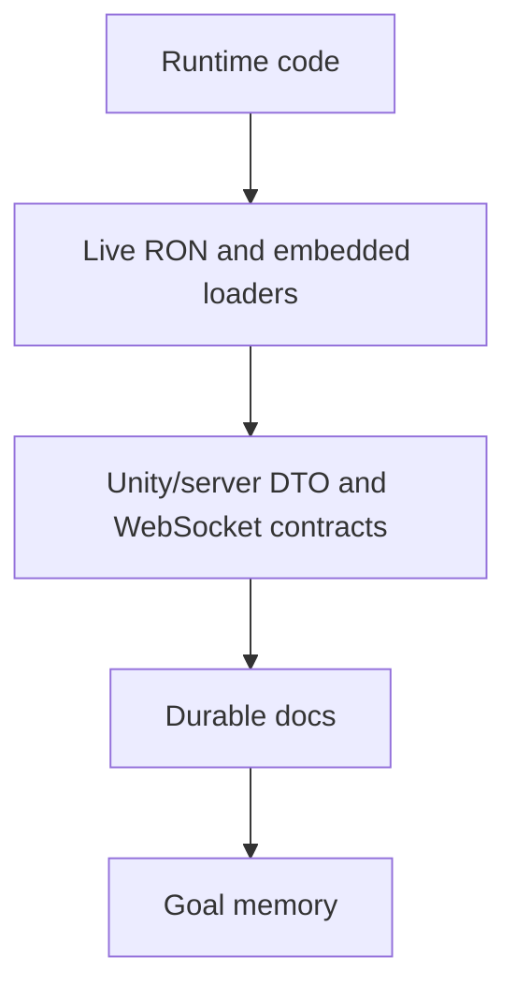
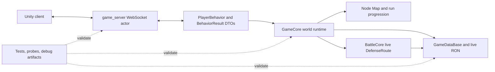

# Project Map

This is the durable entry point for navigating `core_enhanced`. It is a map, not a replacement for the source of truth. When this document and runtime code disagree, inspect the code and live data first, then update the map.

## Source Of Truth

Use this order when investigating behavior:

1. Runtime code under [src/game](../src/game).
2. Live data under `/mnt/f/work/simulator/game_resources/data` and embedded loader code in [data/mod.rs](../src/game/data/mod.rs).
3. Server and Unity-facing contracts in `/mnt/f/work/simulator/game_server` and `/mnt/f/unity projects/ark/docs`.
4. Durable docs such as [game_rulebook.md](game_rulebook.md), [core_runtime_contract.md](core_runtime_contract.md), and [skill_target_contract.md](skill_target_contract.md).
5. Goal documents under [goals](goals).

## Top-Level Shape

Related files:

- Core package root: [Cargo.toml](../Cargo.toml), [lib.rs](../src/lib.rs), [game/mod.rs](../src/game/mod.rs)
- Command/result DTOs: [behavior.rs](../src/game/behavior.rs)
- World runtime: [world.rs](../src/game/world.rs), [world/state.rs](../src/game/world/state.rs), [world/snapshot.rs](../src/game/world/snapshot.rs)
- Map runtime: [map/mod.rs](../src/game/map/mod.rs)
- Battle runtime: [battle/mod.rs](../src/game/battle/mod.rs), [battle/core/mod.rs](../src/game/battle/core/mod.rs)
- Data runtime: [data/mod.rs](../src/game/data/mod.rs)
- Server boundary: `/mnt/f/work/simulator/game_server/src/game/player_game_actor`
- Unity canonical docs: `/mnt/f/unity projects/ark/docs/unity_core_contract.md`, `/mnt/f/unity projects/ark/docs/core_unity_battle_transport_contract.md`

## Detailed Maps

- [Map Index](maps/index.md)
- [Runtime Map](maps/runtime.md)
- [Game Flow Map](maps/game-flow.md)
- [Battle Map](maps/battle.md)
- [Data And Content Map](maps/data-and-content.md)
- [Unity Server Boundary Map](maps/unity-server-boundary.md)
- [Tests And Tools Map](maps/tests-and-tools.md)

## Reading Routes

For a new contributor:

1. Read this file.
2. Read [docs/README.md](README.md) to understand durable docs versus goal memory.
3. Follow [Game Flow Map](maps/game-flow.md) to understand the player-visible loop.
4. Read [Runtime Map](maps/runtime.md) for command dispatch and state ownership.
5. Open [Battle Map](maps/battle.md) only after the live `DefenseRoute` flow is needed.

For a senior change-impact pass:

1. Start with the relevant change path below.
2. Open the files linked beside the Mermaid box, not only the diagram.
3. Check tests and probes from [Tests And Tools Map](maps/tests-and-tools.md).
4. If Unity-facing shape changes, read the external canonical docs before editing code.

## Change-Impact Paths

Player command or result:

- Start at [behavior.rs](../src/game/behavior.rs).
- Follow dispatch in [world.rs](../src/game/world.rs).
- Check server mapping in `/mnt/f/work/simulator/game_server/src/game/player_game_actor/state.rs` and `/mnt/f/work/simulator/game_server/src/game/player_game_actor/messages.rs`.
- Check external `/mnt/f/unity projects/ark/docs/unity_core_contract.md`.

Node Map or world flow:

- Start at [world.rs](../src/game/world.rs), [world/node_flow.rs](../src/game/world/node_flow.rs), and [map/progression.rs](../src/game/map/progression.rs).
- Check snapshots in [world/snapshot.rs](../src/game/world/snapshot.rs).
- Check gameplay policy in [game_rulebook.md](game_rulebook.md).

Battle runtime:

- Start at [world/combat.rs](../src/game/world/combat.rs), [battle/core/mod.rs](../src/game/battle/core/mod.rs), and [battle/core/sim.rs](../src/game/battle/core/sim.rs).
- Check event/checkpoint policy in [core_runtime_contract.md](core_runtime_contract.md).
- Check external `/mnt/f/unity projects/ark/docs/core_unity_battle_transport_contract.md`.

Skill, targeting, and range:

- Start at [ability.rs](../src/game/ability.rs), [range_preview.rs](../src/game/range_preview.rs), [battle/tile_range.rs](../src/game/battle/tile_range.rs), and [battle/core/targeting.rs](../src/game/battle/core/targeting.rs).
- Check [skill_target_contract.md](skill_target_contract.md).

Live RON or data validation:

- Start at [data/mod.rs](../src/game/data/mod.rs), [data/validation.rs](../src/game/data/validation.rs), and [tests/ron_loading.rs](../tests/ron_loading.rs).
- Check `/mnt/f/work/simulator/game_resources/data`.

Tests, probes, and debug artifacts:

- Start at [Tests And Tools Map](maps/tests-and-tools.md).
- Treat [tests](../tests), [world/tests](../src/game/world/tests), and game_server actor tests as executable evidence.
- Treat `battle_records`, `debug_event_log_exports`, `logs`, and `tmp` as debug output unless a test asserts on them.
