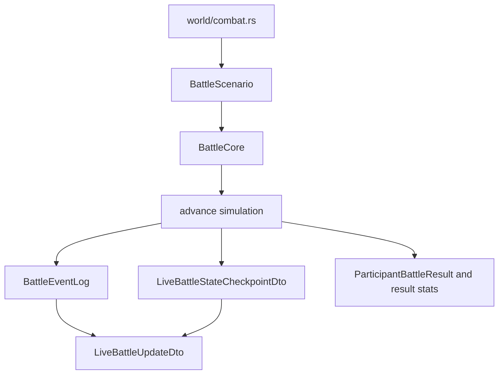
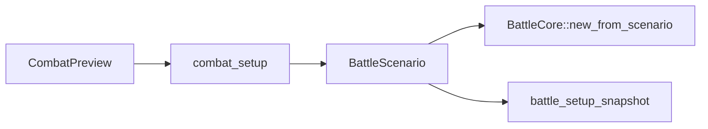
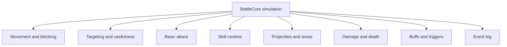
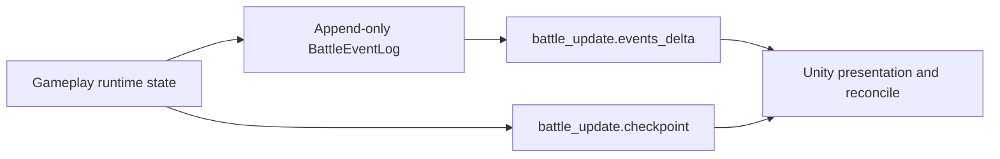

# Battle Map

The official live combat path is `DefenseRoute`. `BattleCore` owns runtime state, live event logging, movement, targeting, damage/effects, and battle completion signals.

## Live Battle Shape

Main files:

- [world/combat.rs](../../src/game/world/combat.rs)
- [battle/core/mod.rs](../../src/game/battle/core/mod.rs)
- [battle/core/sim.rs](../../src/game/battle/core/sim.rs)
- [battle/core/commands.rs](../../src/game/battle/core/commands.rs)
- [battle/scenario.rs](../../src/game/battle/scenario.rs)
- [battle/event_log.rs](../../src/game/battle/event_log.rs)
- [battle/result_stats.rs](../../src/game/battle/result_stats.rs)
- [core_runtime_contract.md](../core_runtime_contract.md)

## Setup

Setup files:

- [combat_preview/mod.rs](../../src/game/combat_preview/mod.rs)
- [combat_setup/battlefield_plan.rs](../../src/game/combat_setup/battlefield_plan.rs)
- [combat_setup/player_spawns.rs](../../src/game/combat_setup/player_spawns.rs)
- [combat_setup/enemy_spawns.rs](../../src/game/combat_setup/enemy_spawns.rs)
- [combat_setup/scenario_groups.rs](../../src/game/combat_setup/scenario_groups.rs)
- [battle/core/build.rs](../../src/game/battle/core/build.rs)

## Simulation Domains

Domain files:

- Movement: [battle/core/movement/mod.rs](../../src/game/battle/core/movement/mod.rs), [movement/engine.rs](../../src/game/battle/core/movement/engine.rs), [movement/blocking.rs](../../src/game/battle/core/movement/blocking.rs), [movement/path.rs](../../src/game/battle/core/movement/path.rs), [movement/types.rs](../../src/game/battle/core/movement/types.rs)
- Targeting: [battle/core/targeting.rs](../../src/game/battle/core/targeting.rs), [battle/core/target_usefulness.rs](../../src/game/battle/core/target_usefulness.rs), [battle/tile_range.rs](../../src/game/battle/tile_range.rs)
- Basic attack: [battle/core/basic_attack.rs](../../src/game/battle/core/basic_attack.rs), [battle/core/basic_attack_projectile.rs](../../src/game/battle/core/basic_attack_projectile.rs)
- Skill runtime: [battle/core/skill_runtime/mod.rs](../../src/game/battle/core/skill_runtime/mod.rs), [skill_runtime/cast.rs](../../src/game/battle/core/skill_runtime/cast.rs), [skill_runtime/projectile.rs](../../src/game/battle/core/skill_runtime/projectile.rs), [skill_runtime/area.rs](../../src/game/battle/core/skill_runtime/area.rs)
- Damage/death: [battle/core/damage_runtime.rs](../../src/game/battle/core/damage_runtime.rs), [battle/core/death_runtime.rs](../../src/game/battle/core/death_runtime.rs), [battle/damage.rs](../../src/game/battle/damage.rs), [battle/death.rs](../../src/game/battle/death.rs)
- Buffs/triggers: [battle/buffs.rs](../../src/game/battle/buffs.rs), [battle/core/triggers.rs](../../src/game/battle/core/triggers.rs), [battle/core/resonance_runtime.rs](../../src/game/battle/core/resonance_runtime.rs)
- Spatial/projectile math: [battle/core/spatial.rs](../../src/game/battle/core/spatial.rs), [battle/core/projectile_math.rs](../../src/game/battle/core/projectile_math.rs)

## Event Log And Checkpoint Boundary

Event/checkpoint files:

- [battle/event_log.rs](../../src/game/battle/event_log.rs)
- [world/combat.rs](../../src/game/world/combat.rs)
- [world/state.rs](../../src/game/world/state.rs)
- [behavior.rs](../../src/game/behavior.rs)
- `/mnt/f/unity projects/ark/docs/core_unity_battle_transport_contract.md`

Important boundary:

- `events_delta` is presentation timing.
- `checkpoint` is reconcile state.
- Gameplay decisions do not use `event_log_seq` as random seed material.
- Official checkpoint units are active presentation units; debug inactive lookup is separate.

## Validation

Battle validation and focused tests live in:

- [battle/validation/mod.rs](../../src/game/battle/validation/mod.rs)
- [battle/validation/validator.rs](../../src/game/battle/validation/validator.rs)
- [tests/skill_runtime_contract.rs](../../tests/skill_runtime_contract.rs)
- [tests/skill_test_suite.rs](../../tests/skill_test_suite.rs)
- [tests/skill_test](../../tests/skill_test)

## When Changing Battle

Battle transport:

- Inspect [world/combat.rs](../../src/game/world/combat.rs), [behavior.rs](../../src/game/behavior.rs), server `/mnt/f/work/simulator/game_server/src/game/player_game_actor/state.rs`, and external `/mnt/f/unity projects/ark/docs/core_unity_battle_transport_contract.md`.

Targeting/range:

- Inspect [skill_target_contract.md](../skill_target_contract.md), [range_preview.rs](../../src/game/range_preview.rs), [battle/tile_range.rs](../../src/game/battle/tile_range.rs), and [battle/core/targeting.rs](../../src/game/battle/core/targeting.rs).

Movement/blocking:

- Inspect [battle/core/movement](../../src/game/battle/core/movement), [battlefield/field.rs](../../src/game/battle/battlefield/field.rs), and [battle/core/types.rs](../../src/game/battle/core/types.rs).

Damage/effects:

- Inspect [ability.rs](../../src/game/ability.rs), [battle/core/damage_runtime.rs](../../src/game/battle/core/damage_runtime.rs), [battle/core/skill_runtime](../../src/game/battle/core/skill_runtime), and [battle/buffs.rs](../../src/game/battle/buffs.rs).
