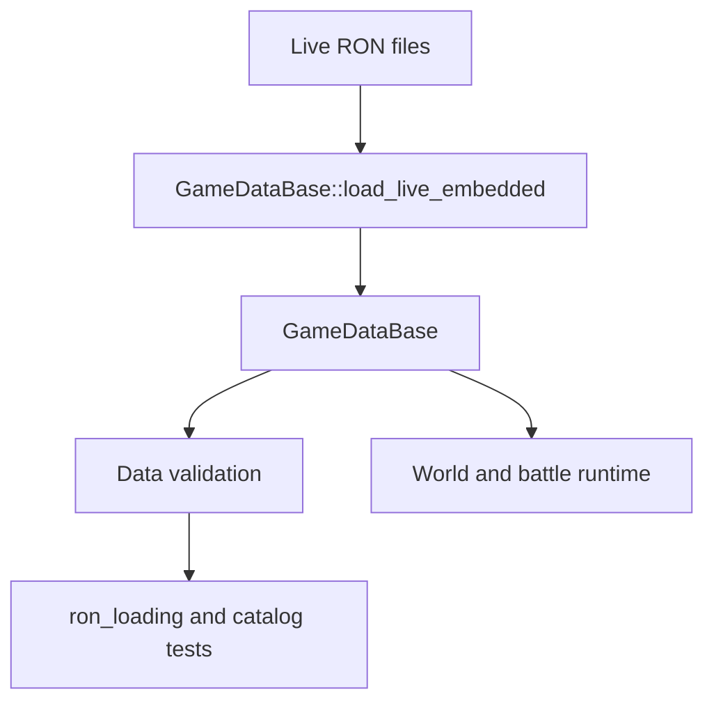
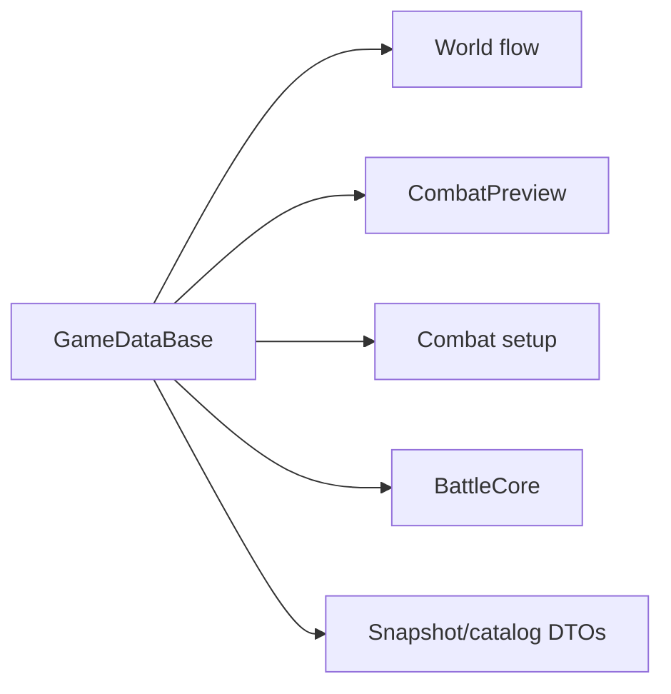

# Data And Content Map

This map shows live authored data, embedded loaders, runtime databases, and validation surfaces.

## Data Ownership

Core files:

- [data/mod.rs](../../src/game/data/mod.rs)
- [data/validation.rs](../../src/game/data/validation.rs)
- [battle/buffs.rs](../../src/game/battle/buffs.rs)
- [map/generator.rs](../../src/game/map/generator.rs)
- [map/types.rs](../../src/game/map/types.rs)
- [combat_preview/mod.rs](../../src/game/combat_preview/mod.rs)
- [core_runtime_contract.md](../core_runtime_contract.md)

Live data root:

- `/mnt/f/work/simulator/game_resources/data`

## Live RON Groups

| Data | Runtime Loader/Types | Live Files |
| --- | --- | --- |
| Abnormalities | [data/abnormality_data.rs](../../src/game/data/abnormality_data.rs) | `/mnt/f/work/simulator/game_resources/data/abnormalities/base.ron` |
| Buffs | [battle/buffs.rs](../../src/game/battle/buffs.rs) | `/mnt/f/work/simulator/game_resources/data/buffs/base.ron` |
| Consumables | [data/consumable_data.rs](../../src/game/data/consumable_data.rs) | `/mnt/f/work/simulator/game_resources/data/consumables/base.ron` |
| Corroded employees | [data/corroded_employee_data.rs](../../src/game/data/corroded_employee_data.rs) | `/mnt/f/work/simulator/game_resources/data/enemies/corroded_employees.ron` |
| Corroded waves | [data/corroded_wave_data.rs](../../src/game/data/corroded_wave_data.rs) | `/mnt/f/work/simulator/game_resources/data/enemies/corroded_wave_presets.ron` |
| Employees | [data/employee_data.rs](../../src/game/data/employee_data.rs) | `/mnt/f/work/simulator/game_resources/data/employees/*.ron` |
| Equipment | [data/equipment_data.rs](../../src/game/data/equipment_data.rs) | `/mnt/f/work/simulator/game_resources/data/equipments/base.ron` |
| Events | [data/event_data.rs](../../src/game/data/event_data.rs) | `/mnt/f/work/simulator/game_resources/data/events/story/base.ron` |
| Map | [map/generator.rs](../../src/game/map/generator.rs), [map/types.rs](../../src/game/map/types.rs) | `/mnt/f/work/simulator/game_resources/data/map/*.ron` |
| PvE encounters | [data/pve_data.rs](../../src/game/data/pve_data.rs) | `/mnt/f/work/simulator/game_resources/data/pve/encounters.ron` |
| Rewards | [data/reward_data.rs](../../src/game/data/reward_data.rs) | `/mnt/f/work/simulator/game_resources/data/events/rewards/base.ron` |
| Run policy | [data/run_policy_data.rs](../../src/game/data/run_policy_data.rs) | `/mnt/f/work/simulator/game_resources/data/run/policy.ron` |
| Shop | [data/shop_data.rs](../../src/game/data/shop_data.rs) | `/mnt/f/work/simulator/game_resources/data/events/shops/base.ron` |
| Skills | [data/skill_data.rs](../../src/game/data/skill_data.rs) | `/mnt/f/work/simulator/game_resources/data/skills/base.ron` |
| Skill fragments | [data/skill_fragment_data.rs](../../src/game/data/skill_fragment_data.rs) | `/mnt/f/work/simulator/game_resources/data/skill_fragments/base.ron` |

Some data files are domain-owned builtins loaded outside the main `GameDataBase::load_live_embedded()` bundle. Map generation policy, map node definitions, battlefield archetypes/templates, run policy defaults, and buff live defaults all have dedicated loader code. Confirm the loader before assuming ownership.

## Runtime Consumers

Consumer files:

- World flow: [world.rs](../../src/game/world.rs), [world/map_content.rs](../../src/game/world/map_content.rs), [world/map_encounters.rs](../../src/game/world/map_encounters.rs)
- Combat preview/setup: [combat_preview/mod.rs](../../src/game/combat_preview/mod.rs), [combat_setup/mod.rs](../../src/game/combat_setup/mod.rs)
- Wave resolution: [wave_resolution.rs](../../src/game/wave_resolution.rs)
- Battle runtime: [battle/core/mod.rs](../../src/game/battle/core/mod.rs)
- Catalog/snapshot output: [world/snapshot.rs](../../src/game/world/snapshot.rs), [behavior.rs](../../src/game/behavior.rs)

## Content Docs

Durable content design docs:

- [skills/lobotomy_content_catalog.md](../skills/lobotomy_content_catalog.md)
- [skills/abnormality_skill_design_notes.ko.md](../skills/abnormality_skill_design_notes.ko.md)
- [skills/skill_fragment_system.md](../skills/skill_fragment_system.md)
- [skills/skill_fragment_wiki.md](../skills/skill_fragment_wiki.md)
- [skills/ego_equipment_wiki.md](../skills/ego_equipment_wiki.md)
- [skills/tool_abnormality_wiki.md](../skills/tool_abnormality_wiki.md)

Live data and runtime validation outrank content docs when availability or field shape is in question.

## Validation Surfaces

- [tests/ron_loading.rs](../../tests/ron_loading.rs)
- [tests/live_skill_catalog_audit.rs](../../tests/live_skill_catalog_audit.rs)
- [tests/live_item_skill_activation.rs](../../tests/live_item_skill_activation.rs)
- [tests/skill_runtime_contract.rs](../../tests/skill_runtime_contract.rs)
- [data/validation.rs](../../src/game/data/validation.rs)
- [combat_preview/validation.rs](../../src/game/combat_preview/validation.rs)
- [battle/validation](../../src/game/battle/validation)

## When Changing Data

Live RON schema:

- Inspect the specific [data](../../src/game/data) module, [data/mod.rs](../../src/game/data/mod.rs), and [data/validation.rs](../../src/game/data/validation.rs).
- Update the nearest durable doc if authoring meaning changes.
- Run `cargo test -p game_core --test ron_loading -- --nocapture` or the equivalent current package command.

Content meaning:

- Inspect live RON first, then content docs under [skills](../skills).
- Check catalog audit tests before treating a design document as implemented.

Range/skill data:

- Inspect [skill_target_contract.md](../skill_target_contract.md), [data/skill_data.rs](../../src/game/data/skill_data.rs), [data/skill_fragment_data.rs](../../src/game/data/skill_fragment_data.rs), and [battle/tile_range.rs](../../src/game/battle/tile_range.rs).
