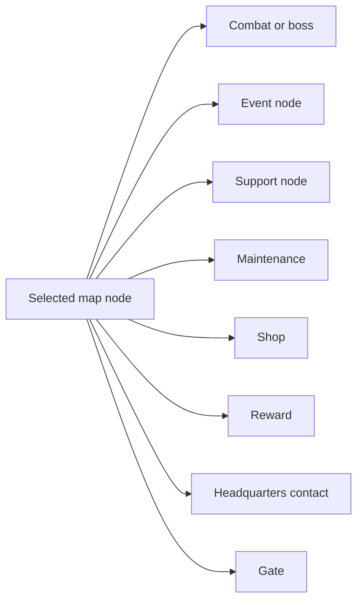
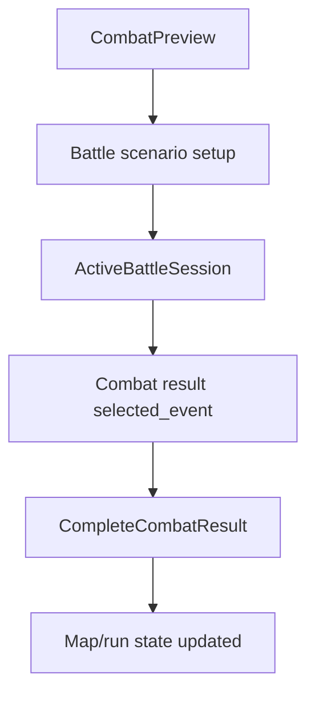

# Game Flow Map

This map follows the player-visible run loop. It is grounded in `GameCore` dispatch and the current durable rulebook.

## Main Loop

```mermaid
flowchart TD
  start[StartNewGame]
  roster[Select starter employees]
  map[Floor map generated]
  select[SelectMapNode]
  confirm[NodeConfirm and preparation]
  resolve[Node-specific resolution]
  outcome[Node result applied]
  next[Next selectable nodes]
  end[Mode-specific clear or failure]

  start --> roster --> map --> select --> confirm --> resolve --> outcome --> next
  next --> select
  outcome --> end
```

Entry files:

- [world.rs](../../src/game/world.rs)
- [world/node_flow.rs](../../src/game/world/node_flow.rs)
- [map/generator.rs](../../src/game/map/generator.rs)
- [map/progression.rs](../../src/game/map/progression.rs)
- [map/session.rs](../../src/game/map/session.rs)
- [game_rulebook.md](../game_rulebook.md)

## Node Categories



Node files:

- Map node data/types: [map/types.rs](../../src/game/map/types.rs)
- Map content and encounters: [world/map_content.rs](../../src/game/world/map_content.rs), [world/map_encounters.rs](../../src/game/world/map_encounters.rs)
- Combat node entry: [world/combat.rs](../../src/game/world/combat.rs)
- Event node: [world/event_node.rs](../../src/game/world/event_node.rs), [data/event_data.rs](../../src/game/data/event_data.rs)
- Support: [world/support.rs](../../src/game/world/support.rs)
- Maintenance: [world/maintenance.rs](../../src/game/world/maintenance.rs)
- Shop: [world/shop.rs](../../src/game/world/shop.rs)
- Reward: [world/reward.rs](../../src/game/world/reward.rs)
- Headquarters: [world/headquarters.rs](../../src/game/world/headquarters.rs)

## Combat Entry And Return



Combat flow files:

- Preview: [combat_preview/mod.rs](../../src/game/combat_preview/mod.rs), [combat_preview/types.rs](../../src/game/combat_preview/types.rs)
- Setup: [combat_setup/mod.rs](../../src/game/combat_setup/mod.rs), [combat_setup/player_spawns.rs](../../src/game/combat_setup/player_spawns.rs), [combat_setup/enemy_spawns.rs](../../src/game/combat_setup/enemy_spawns.rs), [combat_setup/rewards.rs](../../src/game/combat_setup/rewards.rs)
- Live battle bridge: [world/combat.rs](../../src/game/world/combat.rs), [battle/scenario.rs](../../src/game/battle/scenario.rs)
- Result stats: [battle/result_stats.rs](../../src/game/battle/result_stats.rs), [battle/recording.rs](../../src/game/battle/recording.rs)

## Progression Ownership

Core owns graph progression, current node, selectable nodes, node completion, and mode-specific floor transitions. Unity renders the map from DTOs and does not recompute selection rules.

Progression files:

- [map/progression.rs](../../src/game/map/progression.rs)
- [map/executor.rs](../../src/game/map/executor.rs)
- [map/types.rs](../../src/game/map/types.rs)
- [world/node_flow.rs](../../src/game/world/node_flow.rs)
- [world/snapshot.rs](../../src/game/world/snapshot.rs)

Live data:

- `/mnt/f/work/simulator/game_resources/data/map/generation_policy.ron`
- `/mnt/f/work/simulator/game_resources/data/map/node_definitions.ron`
- `/mnt/f/work/simulator/game_resources/data/run/policy.ron`

## When Changing Game Flow

Node selection or map navigation:

- Inspect [map/progression.rs](../../src/game/map/progression.rs), [world/node_flow.rs](../../src/game/world/node_flow.rs), and [world/snapshot.rs](../../src/game/world/snapshot.rs).
- Check [game_rulebook.md](../game_rulebook.md) and external `/mnt/f/unity projects/ark/docs/unity_core_contract.md`.

Node result, rewards, or completion:

- Inspect the specific [world](../../src/game/world) handler plus [reward_policy.rs](../../src/game/reward_policy.rs), [reward.rs](../../src/game/reward.rs), and [world/state.rs](../../src/game/world/state.rs).
- Check [world/tests](../../src/game/world/tests).

Event-started combat:

- Inspect [world/event_node.rs](../../src/game/world/event_node.rs), [events/combat.rs](../../src/game/events/combat.rs), and [world/combat.rs](../../src/game/world/combat.rs).
