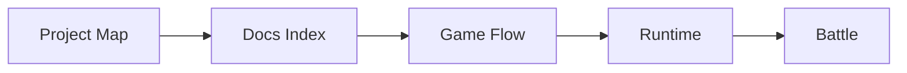
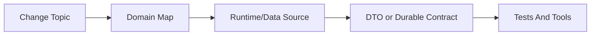

# Project Maps Index

These maps split the project by reader task. Use Mermaid for relationship shape and the file links for actual navigation.

## Map Set

| Map | Use It For |
| --- | --- |
| [Project Map](../PROJECT_MAP.md) | Top-level orientation and change-impact routes. |
| [Runtime](runtime.md) | `GameCore`, state ownership, command dispatch, snapshots, and runtime boundaries. |
| [Game Flow](game-flow.md) | Player-visible run flow from start through map nodes, battle, rewards, and progression. |
| [Battle](battle.md) | Live `DefenseRoute`, `BattleCore`, movement, targeting, event log, checkpoint, and result flow. |
| [Data And Content](data-and-content.md) | `GameDataBase`, embedded RON, content databases, validation, and live authoring. |
| [Unity Server Boundary](unity-server-boundary.md) | Core/server/Unity command, snapshot, battle transport, and admin boundaries. |
| [Tests And Tools](tests-and-tools.md) | Rust tests, server mapping tests, Unity probes, debug exports, and logs. |

## Suggested Order

New contributors:

Senior impact analysis:

## Navigation Rules

- Prefer links in the map pages over searching from scratch.
- If a diagram box has no nearby file link, treat that as a map bug and update the map.
- Do not copy external Unity canonical docs into this repository.
- Goal documents can explain why a change happened, but durable docs and runtime code define what is current.
