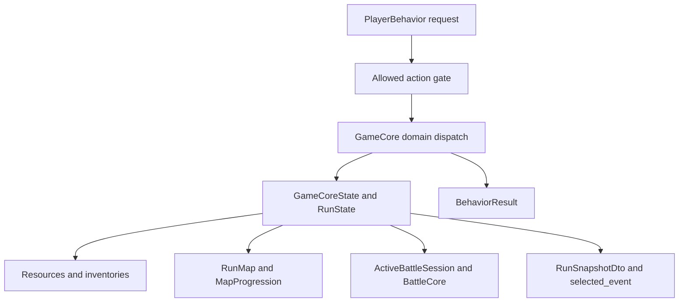
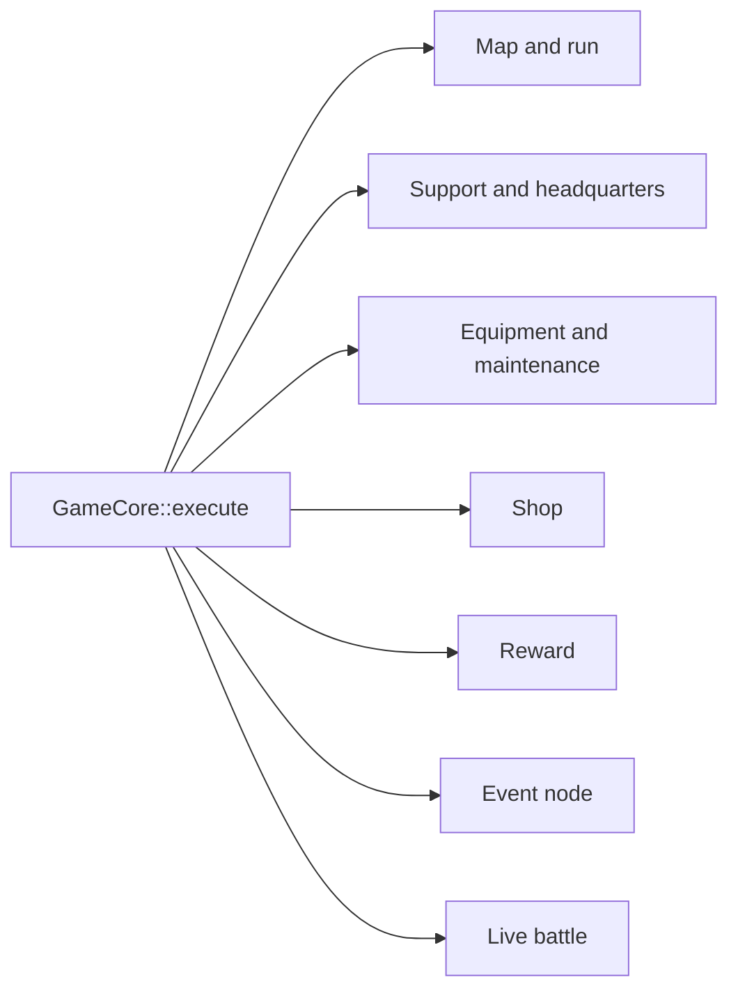
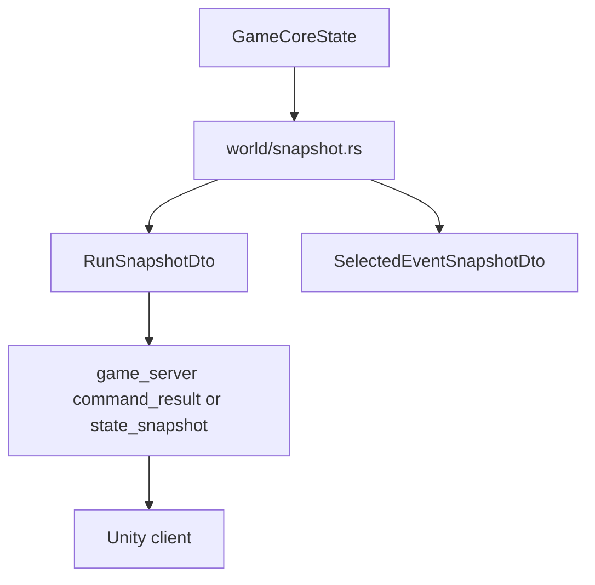

# Runtime Map

This map follows runtime ownership inside `core_enhanced`. It focuses on where state lives, where commands enter, and where snapshots leave.

## Runtime Ownership

Core files:

- [behavior.rs](../../src/game/behavior.rs)
- [world.rs](../../src/game/world.rs)
- [world/state.rs](../../src/game/world/state.rs)
- [world/snapshot.rs](../../src/game/world/snapshot.rs)
- [resources/mod.rs](../../src/game/resources/mod.rs)
- [resources/state.rs](../../src/game/resources/state.rs)
- [resources/selection.rs](../../src/game/resources/selection.rs)
- [resources/inventory.rs](../../src/game/resources/inventory.rs)

## Command Dispatch

`GameCore::execute` validates `ActionKind` first, then routes each `PlayerBehavior` to one domain handler.

Domain files:

- Map/run: [world/node_flow.rs](../../src/game/world/node_flow.rs), [world/map_content.rs](../../src/game/world/map_content.rs), [map/mod.rs](../../src/game/map/mod.rs)
- Support/headquarters: [world/support.rs](../../src/game/world/support.rs), [world/headquarters.rs](../../src/game/world/headquarters.rs)
- Equipment/maintenance: [world/maintenance.rs](../../src/game/world/maintenance.rs), [resources/item_slot.rs](../../src/game/resources/item_slot.rs)
- Shop: [world/shop.rs](../../src/game/world/shop.rs)
- Reward: [world/reward.rs](../../src/game/world/reward.rs), [reward.rs](../../src/game/reward.rs), [reward_policy.rs](../../src/game/reward_policy.rs)
- Event node: [world/event_node.rs](../../src/game/world/event_node.rs), [events/mod.rs](../../src/game/events/mod.rs)
- Combat: [world/combat.rs](../../src/game/world/combat.rs)

## Runtime State

`GameCoreState` owns the current run, roster, inventory, map/session state, active battle session, and checkpoint payload. `RunState` owns run-specific progression such as the generated map, combat previews, abnormality attempts, research, boss omen state, and node sessions.

State files:

- [world/state.rs](../../src/game/world/state.rs)
- [employee.rs](../../src/game/employee.rs)
- [employee_trust.rs](../../src/game/employee_trust.rs)
- [skill_fragment.rs](../../src/game/skill_fragment.rs)
- [abnormality_research.rs](../../src/game/abnormality_research.rs)
- [boss_omen.rs](../../src/game/boss_omen.rs)
- [growth.rs](../../src/game/growth.rs)
- [stats.rs](../../src/game/stats.rs)

## Snapshot Boundary

Snapshot files:

- [world/snapshot.rs](../../src/game/world/snapshot.rs)
- [behavior.rs](../../src/game/behavior.rs)
- `/mnt/f/work/simulator/game_server/src/game/player_game_actor/state.rs`
- `/mnt/f/unity projects/ark/docs/unity_core_contract.md`

## When Changing Runtime

Player command or allowed action:

- Inspect [behavior.rs](../../src/game/behavior.rs), [world.rs](../../src/game/world.rs), and [resources/action.rs](../../src/game/resources/action.rs).
- Then inspect server deserialization/mapping in `/mnt/f/work/simulator/game_server/src/game/player_game_actor/messages.rs` and `/mnt/f/work/simulator/game_server/src/game/player_game_actor/state.rs`.

Snapshot field:

- Inspect [world/snapshot.rs](../../src/game/world/snapshot.rs) and the DTO type in [behavior.rs](../../src/game/behavior.rs).
- If Unity sees it, update `/mnt/f/unity projects/ark/docs/unity_core_contract.md`.

State transition:

- Inspect [world.rs](../../src/game/world.rs), the specific [world](../../src/game/world) domain file, and [resources/state.rs](../../src/game/resources/state.rs).
- Check focused tests under [world/tests](../../src/game/world/tests).
