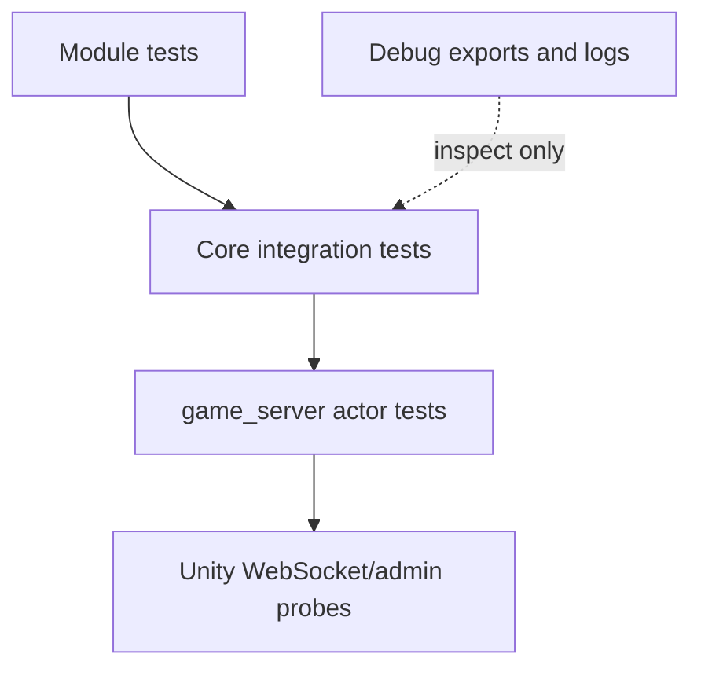

# Tests And Tools Map

This map shows where evidence lives. Use tests and probes to prove behavior; use debug artifacts to inspect behavior, not as source of truth.

## Evidence Layers



## Core Tests

Integration tests:

- [tests/ron_loading.rs](../../tests/ron_loading.rs)
- [tests/live_skill_catalog_audit.rs](../../tests/live_skill_catalog_audit.rs)
- [tests/live_item_skill_activation.rs](../../tests/live_item_skill_activation.rs)
- [tests/skill_runtime_contract.rs](../../tests/skill_runtime_contract.rs)
- [tests/skill_test_suite.rs](../../tests/skill_test_suite.rs)
- [tests/skill_test](../../tests/skill_test)
- [tests/common/mod.rs](../../tests/common/mod.rs)
- [tests/test_actor/mod.rs](../../tests/test_actor/mod.rs)

World/module tests:

- [world/tests](../../src/game/world/tests)
- [world/admin/tests.rs](../../src/game/world/admin/tests.rs)
- [map/generator.rs](../../src/game/map/generator.rs)
- [data/run_policy_data.rs](../../src/game/data/run_policy_data.rs)

Battle validation:

- [battle/validation](../../src/game/battle/validation)
- [battle/core/sim.rs](../../src/game/battle/core/sim.rs)
- [battle/core/commands.rs](../../src/game/battle/core/commands.rs)

## Server Tests And Probes

Server actor and transport tests live in:

- `/mnt/f/work/simulator/game_server/src/game/player_game_actor/messages.rs`
- `/mnt/f/work/simulator/game_server/src/game/player_game_actor/state.rs`
- `/mnt/f/work/simulator/game_server/src/game/player_game_actor/handlers.rs`
- `/mnt/f/work/simulator/game_server/src/game/player_game_actor/session.rs`

Unity probe documents/scripts live in:

- `/mnt/f/unity projects/ark/docs/probe/unity_ws_smoke_probe.py`
- `/mnt/f/unity projects/ark/docs/probe/unity_ws_smoke_test_contract.md`
- `/mnt/f/unity projects/ark/docs/probe/unity_admin_debug_command_probe.py`
- `/mnt/f/unity projects/ark/docs/probe/unity_admin_debug_command_contract.md`
- `/mnt/f/unity projects/ark/docs/probe/unity_noncombat_node_ws_contract.md`
- `/mnt/f/unity projects/ark/docs/probe/unity_savepoint_checkpoint_probe.py`

## Debug Artifacts

These are useful for investigation but are not policy/source-of-truth by themselves:

- [battle_records](../../battle_records)
- [debug_event_log_exports](../../debug_event_log_exports)
- [logs](../../logs)
- [tmp](../../tmp)
- `target/battle_records`
- `target/debug_event_log_exports`
- `target/test-output`

The current policy for debug artifacts is described in [refactor_preparation_plan.md](../refactor_preparation_plan.md).

## Suggested Validation By Change

Live RON/data:

```text
cargo test -p game_core --test ron_loading -- --nocapture
```

World/node flow:

```text
cargo test -p game_core world -- --nocapture
```

Skill/range/runtime:

```text
cargo test -p game_core --test skill_runtime_contract -- --nocapture
cargo test -p game_core --test skill_test_suite -- --nocapture
```

Server command/transport:

```text
cargo test -p game_server player_game_actor -- --nocapture
```

Broad check:

```text
cargo check
cargo test -- --test-threads=1
```

Adjust package names to the active workspace if the command is run from a parent workspace.

## When Choosing Evidence

- Use focused tests for the behavior you changed.
- Use external probes when WebSocket/admin contract shape changes.
- Do not rely on debug JSON exports as golden fixtures unless a test explicitly asserts their shape.
- If a map or durable doc changes without code changes, run link/grep validation instead of broad Rust tests unless the doc claims a runtime fact that needs fresh proof.
