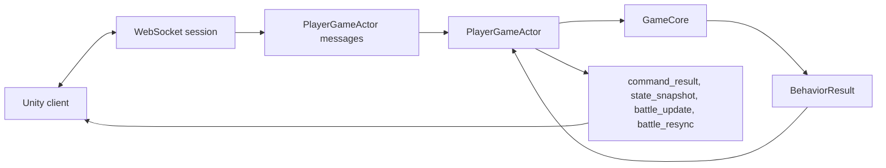
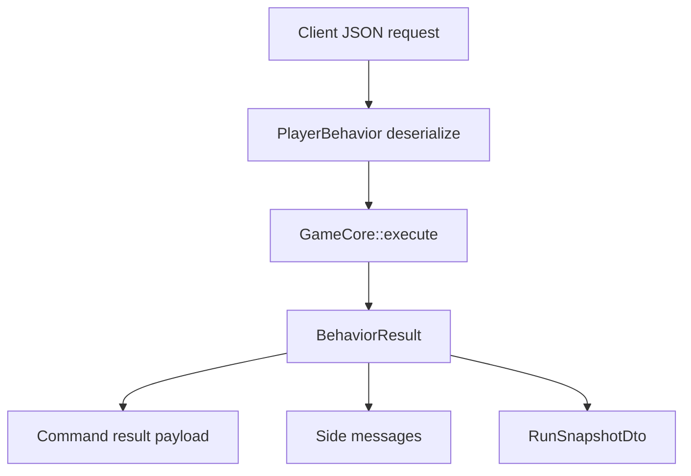
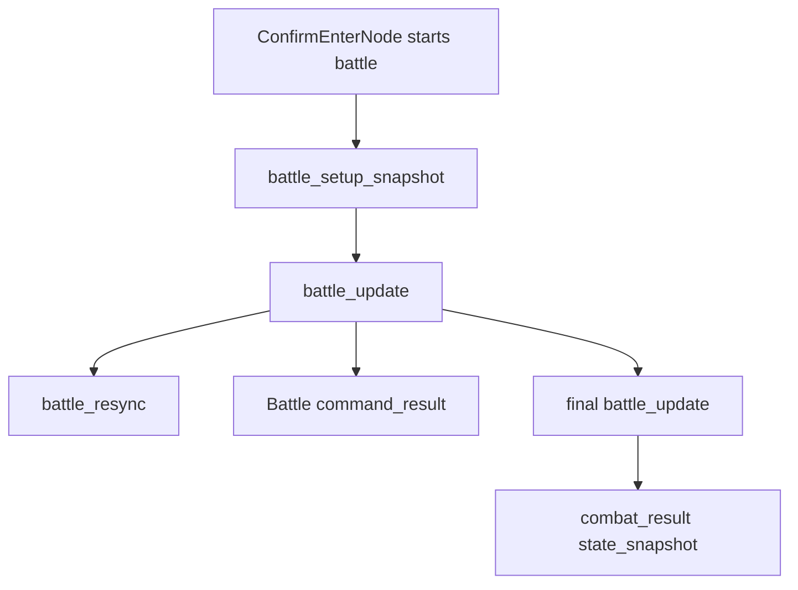

# Unity Server Boundary Map

This map shows how Unity-facing commands and messages pass through `game_server` into `game_core`.

## Transport Shape

Core files:

- [behavior.rs](../../src/game/behavior.rs)
- [world.rs](../../src/game/world.rs)
- [world/snapshot.rs](../../src/game/world/snapshot.rs)
- [world/combat.rs](../../src/game/world/combat.rs)

Server files:

- `/mnt/f/work/simulator/game_server/src/game/player_game_actor/session.rs`
- `/mnt/f/work/simulator/game_server/src/game/player_game_actor/messages.rs`
- `/mnt/f/work/simulator/game_server/src/game/player_game_actor/handlers.rs`
- `/mnt/f/work/simulator/game_server/src/game/player_game_actor/state.rs`
- `/mnt/f/work/simulator/game_server/src/game/player_game_actor/mod.rs`

External canonical docs:

- `/mnt/f/unity projects/ark/docs/unity_core_contract.md`
- `/mnt/f/unity projects/ark/docs/core_unity_battle_transport_contract.md`
- `/mnt/f/unity projects/ark/docs/unity_client_implementation_goal.md`

## Command And Result Boundary

Important files:

- Core DTOs: [behavior.rs](../../src/game/behavior.rs)
- Core dispatch: [world.rs](../../src/game/world.rs)
- Snapshot assembly: [world/snapshot.rs](../../src/game/world/snapshot.rs)
- Server request parsing: `/mnt/f/work/simulator/game_server/src/game/player_game_actor/messages.rs`
- Server result mapping: `/mnt/f/work/simulator/game_server/src/game/player_game_actor/state.rs`

## Live Battle Transport

Important boundary:

- Battle scene construction comes from `battle_setup_snapshot`.
- Live presentation comes from `battle_update.events_delta`.
- Reconcile/recovery comes from `battle_update.checkpoint` and `battle_resync`.
- Final combat result snapshot follows final battle update.

Files:

- [world/combat.rs](../../src/game/world/combat.rs)
- [battle/event_log.rs](../../src/game/battle/event_log.rs)
- [behavior.rs](../../src/game/behavior.rs)
- `/mnt/f/work/simulator/game_server/src/game/player_game_actor/state.rs`
- `/mnt/f/work/simulator/game_server/src/game/player_game_actor/handlers.rs`
- `/mnt/f/unity projects/ark/docs/core_unity_battle_transport_contract.md`

## Admin Boundary

Admin commands are separate top-level server messages, not `PlayerBehavior` gameplay requests.

Files:

- [world/admin.rs](../../src/game/world/admin.rs)
- [world/admin/commands.rs](../../src/game/world/admin/commands.rs)
- [world/admin/catalog.rs](../../src/game/world/admin/catalog.rs)
- [world/admin/grants.rs](../../src/game/world/admin/grants.rs)
- `/mnt/f/work/simulator/game_server/src/game/player_game_actor/session.rs`
- `/mnt/f/unity projects/ark/docs/probe/unity_admin_debug_command_contract.md`
- `/mnt/f/unity projects/ark/docs/probe/unity_admin_debug_command_probe.py`

## When Changing Unity-Facing Shape

Player command:

- Update [behavior.rs](../../src/game/behavior.rs).
- Check server parse tests in `/mnt/f/work/simulator/game_server/src/game/player_game_actor/messages.rs`.
- Update `/mnt/f/unity projects/ark/docs/unity_core_contract.md`.

Battle setup/update/resync:

- Update [world/combat.rs](../../src/game/world/combat.rs), [behavior.rs](../../src/game/behavior.rs), and server mapping in `/mnt/f/work/simulator/game_server/src/game/player_game_actor/state.rs`.
- Update `/mnt/f/unity projects/ark/docs/core_unity_battle_transport_contract.md`.

Snapshot field:

- Update [world/snapshot.rs](../../src/game/world/snapshot.rs) and external `/mnt/f/unity projects/ark/docs/unity_core_contract.md`.

Probe surface:

- Inspect `/mnt/f/unity projects/ark/docs/probe`.
- Do not add local stale copies of Unity canonical docs.
