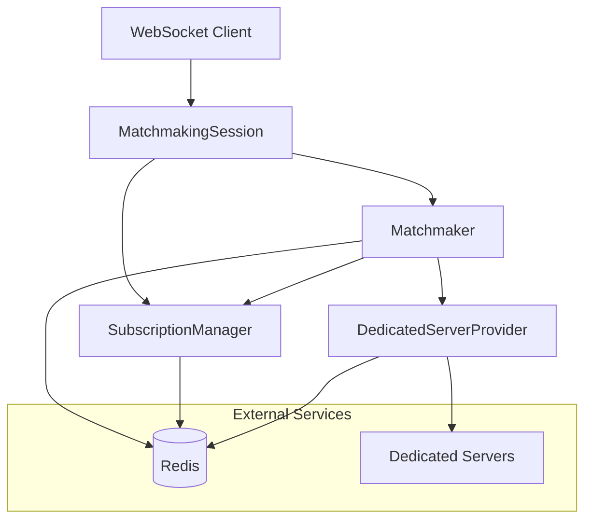
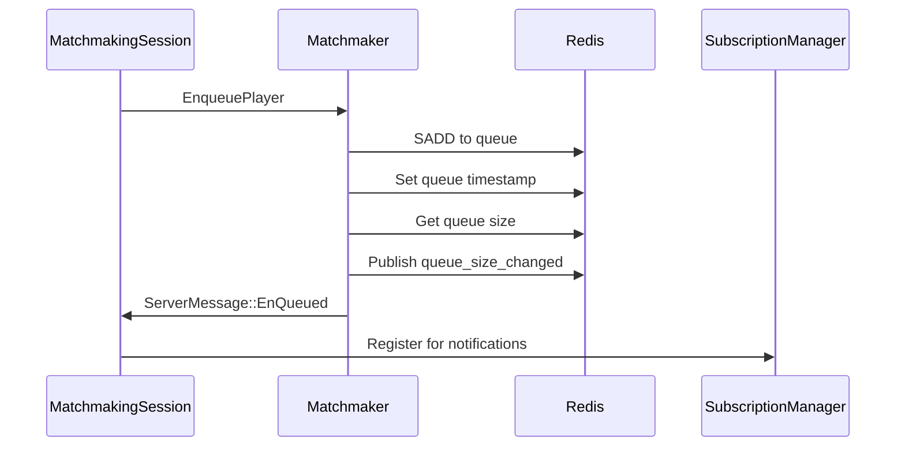
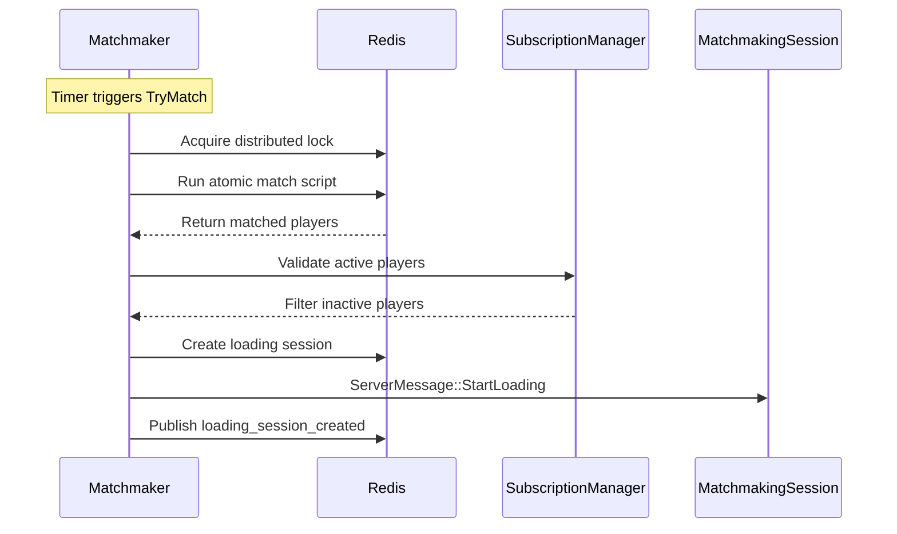
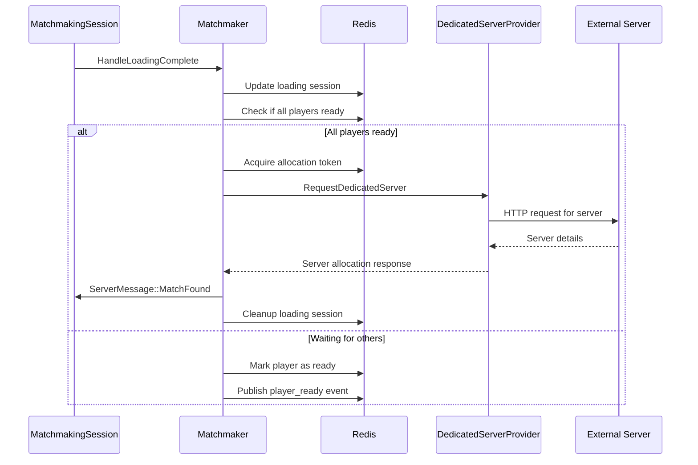
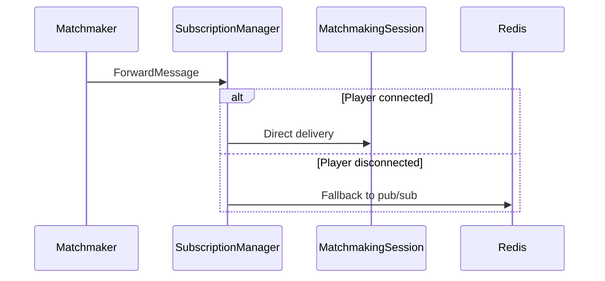

# Match Server Architecture Documentation

## Overview

The match server is built using the Actix actor model, providing a distributed matchmaking system for real-time multiplayer games. The system handles player queuing, match formation, loading coordination, and dedicated server allocation.

## Actor System Overview



## Core Actors

### 1. MatchmakingSession (`ws_session.rs`)

**Purpose**: Handles individual WebSocket connections and player session state.

**State Machine**:
```
Idle → Enqueuing → InQueue → InLoading → Completed
  ↓        ↓         ↓          ↓
  → Disconnecting ← ← ← ← ← ← ← ←
  ↓        ↓         ↓          ↓
  → Error ← ← ← ← ← ← ← ← ← ← ← ←
```

**Key Messages**:
- `ClientMessage::Enqueue` → `EnqueuePlayer` to Matchmaker
- `ClientMessage::LoadingComplete` → `HandleLoadingComplete` to Matchmaker
- `ServerMessage::*` → Updates session state and sends to client

**State Transitions**:
- **Idle → Enqueuing**: Player sends enqueue request
- **Enqueuing → InQueue**: Successfully added to queue
- **InQueue → InLoading**: Match found, loading session created
- **InLoading → Completed**: All players loaded, dedicated server allocated
- **Any → Error**: Invalid state transition or error occurs
- **Any → Disconnecting**: Player disconnects

### 2. Matchmaker (`matchmaker/actor.rs`)

**Purpose**: Core matchmaking logic including queue management, match formation, and loading coordination.

**Key Components**:
- Timer-based matching attempts (`TryMatch`)
- Loading session timeout monitoring (`CheckStaleLoadingSessions`)
- Player lifecycle management (enqueue/dequeue)

**Message Flow**:

#### Enqueue Flow


#### Match Formation Flow


#### Loading Complete Flow


**Key Messages**:
- `EnqueuePlayer`: Add player to queue
- `DequeuePlayer`: Remove player from queue  
- `TryMatch`: Attempt to form matches (timer-driven)
- `HandleLoadingComplete`: Player finished loading
- `CancelLoadingSession`: Handle disconnection during loading
- `CheckStaleLoadingSessions`: Cleanup expired loading sessions
- `DelayedRequeuePlayers`: Re-queue players after delay

### 3. SubscriptionManager (`pubsub.rs`)

**Purpose**: Manages direct WebSocket connections for real-time message delivery.

**Key Functions**:
- Register/deregister WebSocket sessions
- Forward messages directly to connected players
- Validate active player connections
- Provide fallback to Redis pub/sub

**Message Flow**:


**Key Messages**:
- `Register`: Register player WebSocket session
- `Deregister`: Remove player WebSocket session
- `ForwardMessage`: Send message to specific player
- `ValidateActivePlayers`: Check which players are still connected
- `GetActiveSessionsDebug`: Get debug info about active sessions

### 4. DedicatedServerProvider (`provider/mod.rs`)

**Purpose**: Manages communication with external dedicated server infrastructure.

**Key Functions**:
- Maintain pool of available servers
- Allocate servers for matches
- Handle server health monitoring
- Retry logic for failed allocations

## Data Flow Patterns

### 1. Message Delivery Strategy

The system uses a dual delivery approach for reliability:

1. **Primary**: Direct WebSocket delivery via SubscriptionManager
2. **Fallback**: Redis pub/sub for disconnected players

```rust
// Unified message sending pattern
async fn send_player_message(
    sub_manager: &Addr<SubscriptionManager>,
    redis: &mut ConnectionManager,
    player_id: Uuid,
    message: ServerMessage,
) -> bool {
    // Try direct delivery first
    sub_manager.do_send(ForwardMessage { player_id, message: message.clone() });
    
    // Also use Redis pub/sub as fallback
    publish_to_redis_channel(redis, player_id, message).await
}
```

### 2. State Event Publishing

All significant state changes are published to Redis channels for external monitoring:

- `events:queue:{game_mode}` - Queue size changes, player requeuing
- `events:session:{session_id}` - Loading session lifecycle
- `events:violation:{code}` - System invariant violations

### 3. Distributed Locking

Critical sections use Redis-based distributed locks to prevent race conditions:

```lua
-- Example: Match formation lock
local lock_key = "lock:match:" .. game_mode
local lock = acquire_lock(redis, lock_key, 30000) -- 30 second timeout
if lock then
    -- Perform atomic match operation
    release_lock(redis, lock_key)
end
```

## Error Handling Strategy

### 1. Graceful Degradation

- Failed direct delivery → Redis pub/sub fallback
- Server allocation failure → Retry with exponential backoff
- Loading timeout → Automatic cleanup and re-queuing

### 2. State Validation

- All state transitions are validated
- Invalid transitions log violations and force error state
- Error state requires explicit cleanup before normal operation

### 3. Cleanup Guarantees

- Player disconnection triggers immediate cleanup
- Stale loading sessions are cleaned up by background timer
- Failed allocations properly clean up Redis state

## Performance Considerations

### 1. Metrics Collection

Comprehensive metrics collection using shared `MetricsCtx` instances:

- Queue wait times per game mode
- Loading duration tracking
- Allocation success/failure rates
- Error counters and violation tracking

### 2. Connection Pooling

- Redis connection manager for efficient connection reuse
- HTTP client pooling for dedicated server communication
- WebSocket connection state caching

### 3. Background Processing

- Timer-based match attempts (configurable interval)
- Asynchronous cleanup operations
- Non-blocking state event publishing

## Configuration

Key configuration parameters:

```toml
[matchmaking]
tick_interval_seconds = 1
loading_session_timeout_seconds = 30
allocation_token_ttl_seconds = 60
max_dedicated_server_retries = 3
dedicated_request_timeout_seconds = 10

[[matchmaking.game_modes]]
id = "Normal_1v1"
required_players = 2
use_mmr_matching = false
```

## Monitoring and Observability

### 1. State Events

Real-time system state via Redis pub/sub:
- Queue size changes
- Loading session lifecycle
- Player state transitions
- Error conditions

### 2. Metrics

Prometheus metrics for operational monitoring:
- Player counts by state and game mode
- Timing histograms for key operations
- Error rates and types
- System health indicators

### 3. Logging

Structured logging with context:
- Player ID and session tracking
- State transition logging
- Error context and stack traces
- Performance timing information

## Deployment Considerations

### 1. Scaling

- Stateless actor design allows horizontal scaling
- Redis serves as shared state store
- Load balancer distributes WebSocket connections

### 2. High Availability

- Redis clustering for state store redundancy
- Multiple matchmaker instances for failover
- Circuit breakers for external service calls

### 3. Monitoring

- Health check endpoints for load balancer
- Metrics export for Prometheus/Grafana
- Distributed tracing support